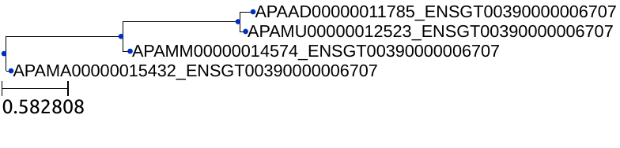
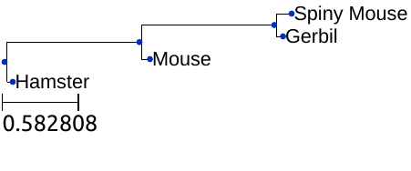
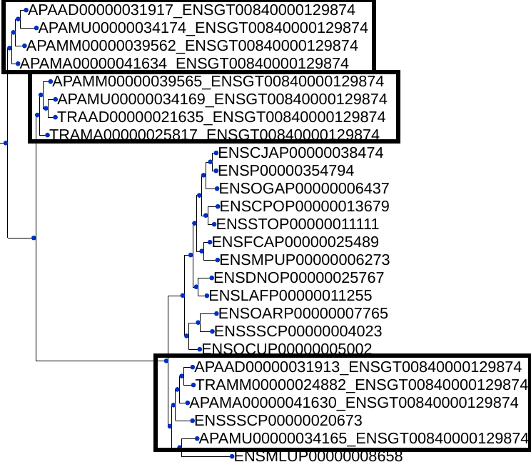

# Quadruplets in Tree

The goal of this project is to find particular quadruplets of sequences in phylogenetic trees.


## Data 


The data used is phylogenetic trees. They are Newick Trees and each leaf of each tree matches with an unique genetic sequence. There are three types of sequences :

* ENS... : Correspond to original sequences of the phylogenetic tree (which can be found at https://www.ensembl.org/index.html )
* TRA... and ADA... : Sequences added in the phylogenetic tree by the research team. We call them *special* sequences and they are divided into four additional species :

	+ AD... : Spiny Mouse (Acomys Dimidiatus)
	+ MU... : Gerbil (Meriones Unguiculatus)
	+ MM... : Mouse (Mus Minutoides) 
	+ MA... : Hamster (Mesocricetus Auratus)

We call *quadruplet* every quadruplet of those special sequences.

## Objective

Each genetic sequence of the four species is replaced in the phylogenetic tree and the goal of this project is to study how they are related to each other, i.e. for each gene, what kind of phylogenetic tree they are forming. The following tree is an example extract from the data for the gene sequence `ENSGT00390000006707` :



In terms of structure, this tree corresponds to the following phylogenetic tree : 



Thus, the study of such trees can provide information about how genes have evolved among these species.

## Validity of a tree and a quadruplet

A tree is said *valid* if it has exactly the same number of each special sequence and if we can split up each quadruplet from the others by taking an induced subtree (i.e. we can cut the tree in such a way that each induced subtree has exactly one quadruplet).

In addition, a quadruplet is said *valid*, if there exists such an induced subtree containing exactly that quadruplet and no additional special sequences.

## Type of a quadruplet

If the quadruplet has the same structure of ancestors/descendant as the example above in this picture, we say that this quadruplet is of type *d+1* where *d* is the minimum number of branches dividing the quadruplet.

If this structure is not preserved, the type of the quadruplet is the opposite, *-d-1*.

Note that if a quadruplet is an induced subtree of the original tree, its type is either *1* or *-1*.


## How to get the quadruplets 


N.B. : To call a tree file in the following function, writing the extension "`.ReconciledTree`" is not mandatory to run.

### From a tree file


To get all the quadruplets from a tree named `file` , one can use the following command  :

```
python3 tree.py file -q
```
It will print out all the quadruplets as trees in the console.

If you prefer to print it out in an graphic interface, you can use the following command :

```
python3 tree.py file -sq
```

It will show one by one the tree of each quadruplet in the graphic interface.

### From a directory of trees 

To compute an analysis on every tree of a directory `dir`, one can use the following command :

```
python3 tree.py dir
```

First it will print some statistics on the trees and the numbers of quadruplets and most of all, it will create 3 text files :

* `output.txt` : Each line of this file is following this format (the words are separated with one tab): `tree type1 type2 ... typeN quadra1 quadra2 ... quadraN` where `tree` is the name of the analysed tree, `type1`, `type2`, ...., `typeN` are the type of the `N` quadruplets found in that tree and `quadra1`, `quadra2`, ..., `quadraN` are the actual subtree of each quadruplet.
* `outputErr.txt` : it contains the names of non-valid trees.
* `outputEmp.txt` : it contains the names of trees which don't have any sequences of the quadruplet.


If you get additional data stored in a directory `new_dir`, you can avoid recomputation by using the following command :

```
python3 tree.py new_dir -a
```

It will automatically add the computations to the output files.

## Useful functions

### Printing a tree

To print a tree `file` in the console, one can use the following command :

```
python3 tree.py file
```

### Showing a tree

To show a tree `file` in the graphic interface, one can use the following command :

```
python3 tree.py file -s
```

## Analysis of the data

For the given data, I could get this output : 6840 valid quadruplets have been found over 4823 trees. There are 2998 non-valid trees and 682 empty trees.

Among the valid trees, 23 of them aren't induced subtrees. For example, in the tree of the gene `ENSGT00840000129874`, there are three quadruplets and one of which isn't an induced subtree.





Moreover, some non-valid trees aren't valid because they are very complex. For example, the tree `ENSGT00760000118948` has nearly 46 special sequences and thus contains a lot of errors. Unfortunately, it seems quite difficult to analyse the 2998 non-valid trees without using much complex criteria. Another trouble is that that number of non-valid trees is too high to be analysed by hand. Thus, we can ask ourselves this question : Can these non-valid trees be ignored? Indeed, we still have a majority of data usable. However, when we have big trees, it is more likely to get an error and so, the biggest trees might be non-valid and we fail to consider these types of trees and the related genes. We are maybe making some bias.
